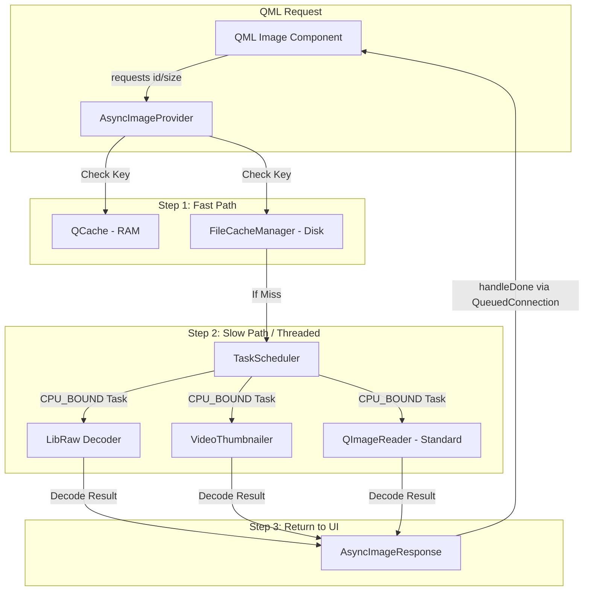

// Update wiring_diagrams.md with deep-dive connections from AsyncImageProvider
// ... (keeping previous content)

#### **4. The Image Loading Pipeline (The "Pixel Engine")**
This diagram illustrates the lifecycle of an image request, from a QML `Image` component to its final delivery from the cache or disk.

#### **5. The Precache & Virtualization Loop**
(Already exists in file...)
