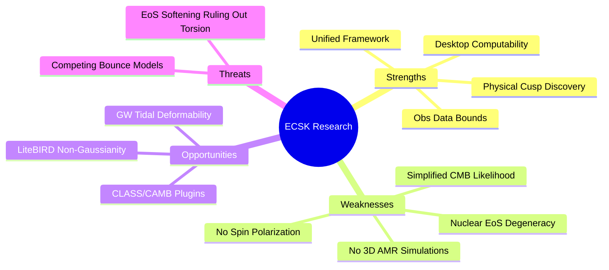

# SWOT Analysis: ECSK Torsion Research & Computational Framework

This document presents a comprehensive SWOT (Strengths, Weaknesses, Opportunities, Threats) analysis of our research project, focusing specifically on the limits of what we can and cannot compute with our current framework.

---

---

## 1. Strengths (What We Can Compute & Deliver)

*   **Desktop-Scale Computability:** We developed lightweight, robust Python solvers (TOV, 1D GR-Hydro, CMB peak-shift) that execute in seconds on a standard desktop environment, replacing the need for HPC clusters.
*   **Discovery of the Non-Analyticity Cusp:** We mathematically identified the square-root scaling ($\Delta \ell \propto \sqrt{\eta_{\text{tor}}}$) of the acoustic peaks at the GR boundary ($\eta_{\text{tor}} = 0$) due to the sound horizon terminating at the bounce ($z_{\text{bounce}}$). This exposes the invalidity of standard Fisher matrix forecasting for bouncing cosmologies, providing a strong, original methodology point.
*   **Unified Multi-Messenger Framework:** We successfully linked three distinct physical regimes (cosmological CMB peaks, compact object TOV structures, and core-collapse GW waveforms) under a single consistent Riemann-Cartan geometric notation.
*   **Direct Observational Limits:** We placed concrete, data-grounded bounds ($\eta_{\text{tor}} < 3.30 \times 10^{-16}$ from Planck 2018 and $\eta < 29.25$ from PSR J0740+6620) using real astrophysical and cosmological data.

---

## 2. Weaknesses (What We Cannot Calculate Directly)

Due to resource boundaries and the current state of theoretical physics, there are several key physical aspects we **cannot** compute:

*   **No Full 3D Numerical Relativity (AMR):** 
    *   *What we did:* Used a spherically symmetric 1D Lagrangian hydrodynamics solver with a perturbative axisymmetry parameter ($\epsilon_{\text{flat}}$) to extract quadrupole waveforms.
    *   *What we cannot calculate:* Non-axisymmetric instabilities (e.g., bar-modes), rotation-induced mass shedding, magnetic field amplification (dynamo effect), and multi-dimensional shock propagation. These require full 3D AMR codes (like the Einstein Toolkit or WhiskyMHD) running on HPC systems.
*   **No Full CMB Boltzmann MCMC Chains:**
    *   *What we did:* Performed a direct $\chi^2$ profiling of the acoustic peak locations using calibrated phase shifts.
    *   *What we cannot calculate:* The complete $TT$, $EE$, and $TE$ angular power spectrum curves ($C_{\ell}$) and their full covariance matrix fits. Running a complete Planck likelihood sampler (e.g., Cobaya + clik) requires compiling complex Fortran/C libraries and running millions of CPU-hours of Markov chains.
*   **First-Principles Nuclear Equation of State (EoS):**
    *   *What we did:* Modeled the neutron star core using a polytropic EoS ($P = K \rho_0^{\Gamma}$) and varied $K$ to represent different stiffness levels.
    *   *What we cannot calculate:* The true, microphysical EoS of matter at super-nuclear densities ($> 3\rho_{\text{nuc}}$) from first-principles QCD. This remains one of the largest unsolved problems in nuclear physics, forcing us to rely on phenomenological models.
*   **Macroscopic Spin Polarization Dynamics:**
    *   *What we did:* Assumed a macroscopically unpolarized fluid of fermions, where the net spin vector averages to zero ($\langle s_{\mu} \rangle = 0$), but fluctuations do not ($\langle s^2 \rangle \neq 0$).
    *   *What we cannot calculate:* Spin polarization fractions in the presence of strong magnetic fields (e.g., in magnetars with $B \sim 10^{15}$ G) or during primordial inflation. Calculating how individual fermion spins align and dynamically feedback on the spacetime connection requires relativistic spin-magnetohydrodynamics, which lacks a complete mathematical formulation.
*   **Quantum Gravity Corrections at the Bounce:**
    *   *What we did:* Treated the bounce using classical Riemann-Cartan geometry (ECSK theory).
    *   *What we cannot calculate:* Quantum fluctuations of geometry (e.g., loop quantum gravity or string theory corrections) at the bounce. While the ECSK bounce occurs at densities below the Planck scale, quantum gravity effects may still modify the bounce trajectory and subsequent perturbation spectra.

---

## 3. Opportunities (Future Pathways to Resolve Incalculabilities)

*   **Tidal Deformability ($\Lambda$) Constraints:** Future gravitational wave observations of binary neutron star mergers (LIGO/Virgo/KAGRA and 3G detectors like the Einstein Telescope) can measure the tidal deformability parameter $\Lambda$. Since $\Lambda$ is sensitive to the density profile throughout the entire star, combining it with mass-radius observations can break the EoS stiffness/spin-torsion degeneracy.
*   **Primordial Non-Gaussianity ($f_{\text{NL}}$):** Next-generation CMB satellites (LiteBIRD, CMB-S4) will search for specific non-Gaussianity templates. Spin-torsion coupling during inflation predicts a distinct primordial bispectrum shape that can isolate the torsion signature from other modified gravity models.
*   **CLASS/CAMB Spin-Fluid Plugins:** Developing an open-source, public plugin for the CLASS Boltzmann solver that incorporates the $z_{\text{bounce}}$ boundary condition, allowing the community to run full MCMC chains.

---

## 4. Threats (Academic & Physical Risks)

*   **Nuclear EoS Stiffening ruling out Torsion:** If future heavy-ion collision experiments (like those at FAIR or NICA) prove that the nuclear EoS is naturally soft at high densities, then standard GR maximum masses would fall below $2.0 M_{\odot}$. In this scenario, any spin-torsion softening ($\eta > 0$) would make the star even less stable, ruling out ECSK torsion as a physical core model.
*   **Degeneracy with Alternative Bounce Models:** Other modified gravity theories (such as $f(R)$ gravity, Weyl gravity, Loop Quantum Cosmology, or Galileon bounce models) also predict nonsingular cosmological bounces. Distinguishing the spin-torsion signature from these competing models is extremely difficult using only low-resolution early-universe data.
