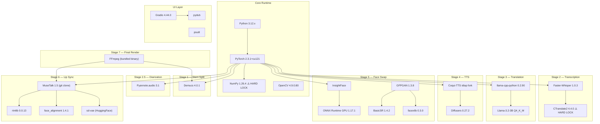

# 📋 just-dub-it2 — Dependency Manual & SWOT Analysis

**Date:** June 9, 2026  
**Codebase Version:** v2.6.5 (Offline AI Studio)  
**Hardware Target:** NVIDIA GTX 1050 Ti (4GB VRAM), Windows

---

## Part 1: The Dependency Manual

### 1.1 The Dependency Chain — Visual Map



---

### 1.2 Hard-Locked Dependencies (Touch These and It Breaks)

These are the dependencies where the version **cannot** be changed without cascading failures:

| Dependency | Pinned Version | Why It's Locked | What Breaks If Changed |
|---|---|---|---|
| **NumPy** | `1.26.4` | MuseTalk + rtmlib + basicsr all require `<2.0` ABI. Torch 2.3 ships with NumPy 2.x by default. | `setup.bat` force-reinstalls after torch. Upgrading causes `AttributeError` across MuseTalk, rtmlib, GFPGAN, and basicsr. |
| **CTranslate2** | `4.4.0` | Faster-Whisper 1.0.3 links directly to CT2 C++ bindings at this version. | Version mismatch = `ImportError` or silent transcription corruption. CT2 4.5+ changed quantization format. |
| **PyTorch** | `2.3.1+cu121` | CUDA 12.1 wheels hard-link to specific `nvidia-*` DLL packages. Bootstrap.py manually injects DLL paths from `env/Lib/site-packages/nvidia/`. | Any PyTorch upgrade changes the DLL layout, breaking `os.add_dll_directory()` in bootstrap.py and translate.py. |
| **Gradio** | `4.44.0` | UI uses `gr.Timer()` (added in 4.x), `gr.ImageEditor()`, and dict-format video objects. Bootstrap sets `GRADIO_TEMP_DIR`. | Gradio 5+ changed the `Video` component API (no more dict format). Gradio 3.x lacks `Timer`. |
| **ONNX Runtime GPU** | `1.17.1` | InSwapper ONNX model was exported with opset 15. ORT 1.17 is the last to support CUDA 12.1 + opset 15 without deprecation warnings. | ORT 1.18+ may require re-export of inswapper model or show CUDA provider failures on Pascal GPUs. |
| **BasicSR** | `1.4.2` | GFPGAN 1.3.8 depends on this exact version. BasicSR 1.5+ dropped support for some internal APIs GFPGAN uses. | `ImportError: cannot import name 'xxx' from 'basicsr'`. |

---

### 1.3 Monkey-Patches & Runtime Hacks (The Fragile Layer)

[bootstrap.py](file:///c:/just-dub-it2/app/bootstrap.py) contains **8 critical monkey-patches** that keep the pipeline alive. If any upstream library updates, these may break silently:

| Patch | What It Does | Risk Level |
|---|---|---|
| `is_torchcodec_available` | Backfills missing attribute in `transformers.utils` (Coqui-TTS assumes older transformers) | 🟡 Medium — will be unnecessary if Coqui is replaced |
| `isin_mps_friendly` | Backfills PyTorch MPS utility in `transformers.pytorch_utils` | 🟢 Low — only hits Apple MPS path |
| `safe_globals` context manager | Allows `torch.load()` with `weights_only=True` for legacy Coqui pickles | 🔴 High — PyTorch 2.4+ changed unpickling security model |
| `is_torch_greater_or_equal` | Version checker shim for transformers | 🟡 Medium |
| `HfFolder` shim | Coqui-TTS expects `huggingface_hub.HfFolder` which was removed in newer `huggingface_hub` | 🔴 High — breaks any TTS model loading |
| `cached_download` shim | Maps deprecated `cached_download` → `hf_hub_download` | 🟡 Medium |
| DLL directory injection | Manually adds NVIDIA CUDA DLL paths for Windows | 🔴 High — any CUDA/PyTorch version change requires updating paths |
| `TRANSFORMERS_OFFLINE=1` | Prevents HuggingFace metadata fetches that hang on air-gapped systems | 🟢 Low — but models must be cached |

**Additionally:** [translate.py](file:///c:/just-dub-it2/app/stages/translate.py#L7-L18) **duplicates** the DLL injection from bootstrap.py (lines 7-18). This is redundant but exists as a safety net because `translate.py` can be imported before bootstrap in some code paths.

---

### 1.4 Hidden Couplings (Non-Obvious Breakpoints)

| Coupling | Files Involved | Description |
|---|---|---|
| **FFmpeg Binary Injection** | [ffmpeg_utils.py](file:///c:/just-dub-it2/app/utils/ffmpeg_utils.py), [lipsync_musetalk.py](file:///c:/just-dub-it2/app/stages/lipsync_musetalk.py), [stem_split.py](file:///c:/just-dub-it2/app/stages/stem_split.py) | `get_env_with_ffmpeg()` prepends `tools/ffmpeg/bin` to PATH. But `lipsync_musetalk.py` calls bare `ffmpeg` (line 276, 354) instead of `ffmpeg_path()`, relying on PATH being correct. If the env injection fails, MuseTalk subprocess can't find FFmpeg. |
| **MuseTalk PYTHONPATH** | [lipsync_musetalk.py](file:///c:/just-dub-it2/app/stages/lipsync_musetalk.py#L88-L91) | MuseTalk is invoked as a subprocess with `PYTHONPATH` manually set to `tools/MuseTalk`. If the internal import structure of MuseTalk changes upstream, inference breaks silently. |
| **Workspace File Protocol** | [pipeline.py](file:///c:/just-dub-it2/app/pipeline.py) ↔ all stages | Stages communicate exclusively via filesystem artifacts (`vocals.wav`, `segments.json`, `translated_segments.json`, etc.). Any stage renaming its output file breaks the entire downstream chain. |
| **FaceSwap Dual-Process Architecture** | [fs_worker.py](file:///c:/just-dub-it2/app/fs_worker.py) ↔ [main_ui.py](file:///c:/just-dub-it2/app/main_ui.py) | FaceSwap runs in a **completely separate process** communicating via JSON files in `workspace/fs_jobs/` and `workspace/fs_status.json`. Race conditions on file writes are possible. |
| **GPU Exclusivity Lock** | [gpu_manager.py](file:///c:/just-dub-it2/app/gpu_manager.py) | There is **no actual lock/mutex** — serialization is achieved purely by single-threaded Queue processing in pipeline.py. If `fs_worker.py` runs a GPU job simultaneously, VRAM will OOM. |
| **VRAM Telemetry Coupling** | [cuda_utils.py](file:///c:/just-dub-it2/app/utils/cuda_utils.py) ↔ [main_ui.py](file:///c:/just-dub-it2/app/main_ui.py) | `IS_PIPELINE_ACTIVE` flag controls polling frequency (5s vs 15s). If the flag gets stuck `True` (crash during pipeline), nvidia-smi is polled 3× more than necessary. |

---

### 1.5 Dependency Version Compatibility Matrix

```
Python 3.12 ──┬── torch 2.3.1+cu121 ──┬── numpy ≤ 1.26.4 (HARD)
              │                        ├── CUDA 12.1 DLLs
              │                        └── nvidia-* wheel packages
              │
              ├── faster-whisper 1.0.3 ── ctranslate2 4.4.0 (HARD)
              │
              ├── coqui-tts (idiap) ──┬── transformers (monkey-patched)
              │                       ├── huggingface_hub (monkey-patched)
              │                       └── torch.serialization (monkey-patched)
              │
              ├── demucs 4.0.1 ─── torchaudio 2.3.1+cu121
              │
              ├── llama-cpp-python 0.2.90 ─── (CPU-only wheel)
              │
              ├── pyannote.audio 3.1 ─── HF_AUTH_TOKEN required
              │
              ├── insightface ─── onnxruntime-gpu 1.17.1
              │
              ├── gfpgan 1.3.8 ──┬── basicsr 1.4.2 (HARD)
              │                  └── facexlib 0.3.0
              │
              ├── MuseTalk 1.5 (git) ──┬── rtmlib 0.0.13
              │                        ├── face_alignment 1.4.1
              │                        └── diffusers 0.27.2
              │
              └── gradio 4.44.0
```

---

## Part 2: SWOT Analysis — 10 Options for Improvement

### Overview Criteria

Each option is evaluated on these axes:
- **4GB VRAM Safety**: Will it still run on GTX 1050 Ti?
- **Effort**: How much work to implement?
- **Risk**: What could break?
- **Impact**: How much does it improve the system?

---

### Option 1: 🔄 Upgrade PyTorch to 2.6+ with CUDA 12.4

**Description:** Upgrade from PyTorch 2.3.1+cu121 to the latest 2.6.x+cu124. This would unlock newer GPU features, better memory management, and native `torch.compile()` for potential speedups.

| **Strengths** | **Weaknesses** |
|---|---|
| ✅ Better VRAM fragmentation handling (PyTorch 2.5+ improved CUDA allocator) | ❌ Every monkey-patch in bootstrap.py must be audited |
| ✅ Native `torch.compile()` support for MuseTalk UNet (~15-30% inference speedup) | ❌ NumPy 1.26.4 pin may conflict (PyTorch 2.6 ships with NumPy 2.x) |
| ✅ Fixes `safe_globals` monkey-patch (native in 2.6) | ❌ All NVIDIA DLL paths in bootstrap.py change |
| ✅ Better Pascal (GTX 1050) backward compat in recent PyTorch | ❌ CTranslate2 4.4.0 may not link against new CUDA libraries |

| **Opportunities** | **Threats** |
|---|---|
| 🔵 Could enable `torch.cuda.memory_efficient_attention` for MuseTalk | 🔴 Coqui-TTS idiap fork may not be compatible with PyTorch 2.6 |
| 🔵 Better error messages for OOM (PyTorch 2.5+ has CUDA OOM diagnostics) | 🔴 `onnxruntime-gpu` 1.17.1 is pinned to CUDA 12.1 — may need ORT upgrade too |
| 🔵 Could drop 3 of the 8 monkey-patches | 🔴 GGUF format changes in llama-cpp may require model re-quantization |

**Verdict:** 🟡 **High Impact, High Risk.** Recommended only as part of a major version bump (v3.0). Requires a full regression test of all 7 stages.

---

### Option 2: 🎯 Replace Coqui-TTS with Piper TTS (Lightweight ONNX)

**Description:** Replace the heavyweight Coqui-TTS (XTTS v2 — 2.5GB model, requires monkey-patches) with [Piper TTS](https://github.com/rhasspy/piper), which runs entirely via ONNX Runtime and uses ~200MB VRAM.

| **Strengths** | **Weaknesses** |
|---|---|
| ✅ Eliminates 5 of 8 monkey-patches in bootstrap.py | ❌ Piper doesn't support voice cloning (no speaker_wav input) |
| ✅ ~90% less VRAM usage for TTS stage | ❌ Would need a separate voice cloning approach (e.g., RVC + Piper) |
| ✅ No more `HfFolder`, `cached_download`, `safe_globals` shims | ❌ Lower voice quality than XTTS v2 for naturalistic dubbing |
| ✅ Pure ONNX = shares runtime with InSwapper (ORT already installed) | ❌ Limited language support compared to XTTS |

| **Opportunities** | **Threats** |
|---|---|
| 🔵 Could run TTS concurrently with other stages (tiny VRAM footprint) | 🔴 Voice quality regression may make the dub sound robotic |
| 🔵 10× faster inference than XTTS v2 | 🔴 No cross-language voice cloning = defeats the core dubbing use case |

**Verdict:** 🟡 **High Impact on stability, but fundamentally changes the product.** Only viable if you accept losing voice cloning, or pair it with a separate RVC voice conversion step.

---

### Option 3: 🧱 Introduce a Dependency Lock File (pip-compile / uv.lock)

**Description:** Replace the loose `requirements.txt` with a fully resolved lockfile using `pip-compile` (pip-tools) or the newer `uv` tool. This freezes every transitive dependency.

| **Strengths** | **Weaknesses** |
|---|---|
| ✅ Eliminates "works on my machine" problems forever | ❌ Initial effort to resolve all conflicts and generate the lockfile |
| ✅ Makes the NumPy force-reinstall hack in setup.bat unnecessary | ❌ Lockfile must be regenerated for any dependency update |
| ✅ Reproducible builds across machines | ❌ `uv` is newer and may have edge cases on Windows |
| ✅ Catches conflicts before deployment (compile-time, not runtime) | ❌ Some deps (coqui-tts from git) may not resolve cleanly |

| **Opportunities** | **Threats** |
|---|---|
| 🔵 Can auto-detect when a dependency has a security vulnerability | 🔴 None significant — this is pure upside |
| 🔵 CI/CD integration becomes trivial | 🔴 Minimal — just maintenance overhead |

**Verdict:** 🟢 **Low Risk, High Impact.** This should be done regardless of any other option. It's the single best investment for pipeline stability.

---

### Option 4: 🏗️ Refactor Pipeline to Use a Proper State Machine (Not File-Based)

**Description:** Replace the current filesystem-artifact-based stage handoff (where stages check for `vocals.wav`, `segments.json`, etc.) with an explicit state machine backed by a lightweight database (SQLite) or structured state file.

| **Strengths** | **Weaknesses** |
|---|---|
| ✅ Eliminates race conditions between stages | ❌ Significant refactor of pipeline.py (453 lines) and all 8 stages |
| ✅ Enables proper retry/rollback per stage | ❌ Must migrate all existing workspace folders |
| ✅ Atomic state transitions (no half-written JSON files) | ❌ Adds a new dependency (SQLite is stdlib, but ORM isn't) |
| ✅ Makes the "Total Project Recall" recovery system robust, not heuristic | ❌ Current file-checking resume logic is simple and battle-tested |

| **Opportunities** | **Threats** |
|---|---|
| 🔵 Could add stage-level rollback (re-run translation without re-splitting) | 🔴 Over-engineering risk — current system works for single-user |
| 🔵 Enables future multi-GPU or distributed processing | 🔴 SQLite WAL mode can have issues on network drives |
| 🔵 Job metadata (timing, errors, ETA) all in one queryable place | |

**Verdict:** 🟡 **Medium Risk, High Long-Term Impact.** Best done incrementally — start by adding a `stage_state.json` manifest to each workspace, then gradually migrate.

---

### Option 5: ⚡ Replace llama-cpp-python (CPU) with ExLlamav2 or vLLM (GPU)

**Description:** The translation stage currently runs Llama on CPU (`llama_supports_gpu_offload() == False` was a known issue). Replace with ExLlamav2 which has efficient 4-bit GPU inference even on 4GB cards.

| **Strengths** | **Weaknesses** |
|---|---|
| ✅ 10-50× faster translation (GPU vs CPU) | ❌ ExLlamav2 requires GPTQ or EXL2 model format (not GGUF) |
| ✅ Frees CPU for FFmpeg encoding while translating | ❌ 4GB VRAM means translation can't run concurrently with other GPU stages |
| ✅ Better context window support | ❌ ExLlamav2 has tighter CUDA version requirements |

| **Opportunities** | **Threats** |
|---|---|
| 🔵 Could use a larger model (7B Q4) since GPU is ~4× faster at inference | 🔴 VRAM headroom on 1050 Ti is already razor-thin; 3B Q4 model uses ~2GB VRAM |
| 🔵 ExLlamav2 has native batching for multi-segment translation | 🔴 The current `gpu_manager.py` serializes GPU access; ExLlamav2 needs exclusive GPU |

**Verdict:** 🟡 **High Impact on translation speed, Medium Risk.** The GGUF → EXL2 model conversion is the main barrier. Could also simply rebuild llama-cpp-python with CUDA support (the current CPU-only build was a setup accident).

---

### Option 6: 🖥️ Upgrade Gradio to 5.x (Modern UI Framework)

**Description:** Upgrade from Gradio 4.44.0 to 5.x for better theming, native dark mode, improved WebSocket performance, and modern component APIs.

| **Strengths** | **Weaknesses** |
|---|---|
| ✅ Native dark mode and theming (currently light-only with custom CSS) | ❌ Gradio 5 changed `Video` component from dict format to path string |
| ✅ Better WebSocket reconnection (current UI disconnects on long jobs) | ❌ `gr.Timer()` API may have changed |
| ✅ Improved mobile responsiveness | ❌ All JavaScript bridge code (`removeJob`, `moveUp`, `openFolder`) needs auditing |
| ✅ Built-in file browser components | ❌ `gr.ImageEditor` API changed significantly |

| **Opportunities** | **Threats** |
|---|---|
| 🔵 Gradio 5 has built-in progress tracking (could replace custom HTML) | 🔴 50KB main_ui.py with embedded HTML strings is fragile |
| 🔵 Better support for WebRTC streaming (live preview) | 🔴 The `gradio_api/file=` path for downloads may have changed |

**Verdict:** 🟡 **Medium Risk, Medium Impact.** The UI code is the largest single file (947 lines, 50KB). A Gradio upgrade should be paired with a UI refactor (see Option 7).

---

### Option 7: 🎨 Extract UI into Components (Break Up main_ui.py)

**Description:** Refactor the 947-line monolithic [main_ui.py](file:///c:/just-dub-it2/app/main_ui.py) into separate modules: `ui/production_hub.py`, `ui/face_lab.py`, `ui/settings.py`, `ui/maintenance.py`, `ui/telemetry.py`.

| **Strengths** | **Weaknesses** |
|---|---|
| ✅ Each tab becomes independently testable | ❌ Gradio's `gr.Blocks` context manager makes modularization awkward |
| ✅ HTML template strings move to separate files | ❌ Shared state (manager, config) requires a proper dependency injection pattern |
| ✅ Reduces merge conflicts when multiple features are developed | ❌ ~8 hours of careful refactoring |
| ✅ Makes the UI code reviewable (currently impenetrable) | |

| **Opportunities** | **Threats** |
|---|---|
| 🔵 Could add unit tests for status table rendering | 🔴 Gradio's internal wiring (elem_id, js bridges) is sensitive to import order |
| 🔵 Enables A/B testing of UI layouts | 🔴 Minimal if done carefully |

**Verdict:** 🟢 **Low Risk, High Impact on maintainability.** This should be the second priority after Option 3 (lockfile).

---

### Option 8: 🛡️ Add a Cross-Process GPU Lock (Mutex) for fs_worker

**Description:** The main pipeline and `fs_worker.py` can currently compete for the GPU. Add a named mutex (Windows) or file lock (cross-platform) so only one process can hold GPU resources at a time.

| **Strengths** | **Weaknesses** |
|---|---|
| ✅ Eliminates OOM from concurrent GPU access | ❌ Adds complexity to both pipeline.py and fs_worker.py |
| ✅ Simple to implement (Windows named mutex or portalocker) | ❌ Deadlock risk if a process crashes while holding the lock |
| ✅ The current "hope nobody runs both at once" approach is a ticking time bomb | ❌ May slow down faceswap if translation is running |
| ✅ <50 lines of code change | |

| **Opportunities** | **Threats** |
|---|---|
| 🔵 Could extend to support multi-GPU in the future | 🔴 Lock timeout must be tuned (MuseTalk chunks can take 10+ minutes) |
| 🔵 gpu_manager.py becomes the single authority for GPU scheduling | 🔴 Windows named mutexes have different semantics than POSIX locks |

**Verdict:** 🟢 **Very Low Risk, Critical Impact.** This is a bug fix disguised as a feature. Should be done ASAP.

---

### Option 9: 📦 Containerize the Environment (Docker / Portable Archive)

**Description:** Package the entire `env/`, `tools/`, and `models/` into a Docker container or a self-extracting portable archive. Eliminates setup.bat entirely.

| **Strengths** | **Weaknesses** |
|---|---|
| ✅ "Works on any Windows machine" deployment | ❌ Docker on Windows requires WSL2 + Hyper-V (complex for non-technical users) |
| ✅ Eliminates the NumPy force-reinstall hack | ❌ Container image would be 15-20GB (models alone are ~5GB) |
| ✅ Reproducible builds without pip version drift | ❌ GPU passthrough in Docker requires nvidia-container-toolkit |
| ✅ Can snapshot known-good states | ❌ Adds infrastructure complexity |

| **Opportunities** | **Threats** |
|---|---|
| 🔵 Could deploy to cloud (RunPod, Vast.ai) for users without GPUs | 🔴 Docker + GPU + Windows is still immature |
| 🔵 Enables CI/CD testing pipelines | 🔴 File I/O performance through Docker volumes can be 2-3× slower |

**Verdict:** 🟡 **High Effort, High Long-Term Payoff.** Better suited as a distribution strategy once the codebase is stable. A **portable Python zip** (no Docker) may be a better middle ground.

---

### Option 10: 🔬 Upgrade MuseTalk to Latest + Replace Whisper with whisper.cpp

**Description:** Two-part upgrade: (a) Update MuseTalk from the pinned git clone to the latest release with improved lip-sync quality, and (b) replace Faster-Whisper/CTranslate2 with whisper.cpp (GGML-based, same as llama.cpp) to unify the inference backend.

| **Strengths** | **Weaknesses** |
|---|---|
| ✅ Latest MuseTalk has better temporal consistency (fewer chunk seam artifacts) | ❌ MuseTalk API/config format may have changed (currently using YAML task config) |
| ✅ whisper.cpp uses ~50% less VRAM than CTranslate2 on Pascal GPUs | ❌ Faster-Whisper → whisper.cpp migration requires changing the transcription API |
| ✅ Eliminates the CTranslate2 4.4.0 hard lock | ❌ whisper.cpp Python bindings are less mature than faster-whisper |
| ✅ Unified GGML backend (whisper.cpp + llama.cpp) simplifies the runtime | ❌ MuseTalk updates may require new model weights (re-download) |

| **Opportunities** | **Threats** |
|---|---|
| 🔵 whisper.cpp supports real-time streaming transcription (future feature) | 🔴 MuseTalk's internal Whisper (in `musetalk/whisper/`) may conflict with system Whisper |
| 🔵 Latest MuseTalk has built-in chunk crossfade (eliminates our custom overlap logic) | 🔴 Import cycle in MuseTalk's whisper module (noted in graph report) could worsen |
| 🔵 Could enable live dubbing preview | 🔴 Testing burden: must verify all 7 stages still produce correct output |

**Verdict:** 🟡 **High Impact on quality, Medium-High Risk.** MuseTalk upgrade and Whisper swap should be done separately, not together.

---

## Part 3: Priority Ranking & Recommended Roadmap

### Tier 1 — Do Now (Low Risk, High Impact)

| Priority | Option | Effort | Impact |
|---|---|---|---|
| **#1** | **Option 3:** Dependency Lock File | 2-3 hours | 🟢 Prevents all future "pip broke my env" disasters |
| **#2** | **Option 8:** Cross-Process GPU Mutex | 1-2 hours | 🟢 Fixes a real OOM bug when Face Lab and pipeline overlap |
| **#3** | **Option 7:** Break Up main_ui.py | 6-8 hours | 🟢 Makes the codebase maintainable |

### Tier 2 — Plan Next (Medium Risk, High Impact)

| Priority | Option | Effort | Impact |
|---|---|---|---|
| **#4** | **Option 5:** Fix LLM GPU Acceleration | 3-4 hours | 🟡 Rebuilding llama-cpp-python with CUDA is the simplest huge win |
| **#5** | **Option 4:** State Machine Refactor | 8-12 hours | 🟡 Start with `stage_state.json`, iterate |
| **#6** | **Option 10:** MuseTalk Upgrade | 4-6 hours | 🟡 Better lip-sync quality, risk of API breakage |

### Tier 3 — Strategic (High Risk, Transformative)

| Priority | Option | Effort | Impact |
|---|---|---|---|
| **#7** | **Option 1:** PyTorch 2.6 Upgrade | 12-16 hours | 🔴 Full regression test required |
| **#8** | **Option 6:** Gradio 5.x Upgrade | 8-12 hours | 🟡 Pair with Option 7 |
| **#9** | **Option 2:** Replace Coqui-TTS | 8-10 hours | 🟡 Only if voice cloning alternative exists |
| **#10** | **Option 9:** Containerization | 16-20 hours | 🟡 Distribution strategy, not development priority |

---

## Part 4: Quick Reference — "What Can I Safely Upgrade?"

| Component | Safe to Upgrade? | Notes |
|---|---|---|
| FFmpeg binary | ✅ Yes | Just swap the binary in `tools/ffmpeg/bin/`. No code changes needed. |
| Gradio | ⚠️ Carefully | Must audit Video component, Timer, ImageEditor APIs |
| NumPy | ❌ No | Hard-locked at 1.26.4 until MuseTalk/rtmlib/basicsr support 2.x |
| PyTorch | ⚠️ Major effort | Requires DLL injection audit, monkey-patch review, full regression |
| Faster-Whisper | ⚠️ Tied to CTranslate2 | Must upgrade both together, verify int8_float16 still works |
| llama-cpp-python | ✅ Yes (minor) | Can upgrade within 0.2.x series. Just rebuild with `--cmake-args "-DGGML_CUDA=ON"` for GPU |
| GFPGAN | ❌ No | Pinned to basicsr 1.4.2 |
| InsightFace | ⚠️ Carefully | Model format may change, ONNX opset compatibility |
| Demucs | ✅ Yes | Stable API, just verify `--two-stems vocals` flag still works |
| pydub | ✅ Yes | Thin wrapper, no version-sensitive code |
| psutil | ✅ Yes | Stable API |

---

> [!IMPORTANT]
> **The #1 recommendation** regardless of which strategic option you choose: **create a dependency lockfile (Option 3) first.** This gives you a rollback point before attempting any upgrade. Without it, a failed upgrade means manually reconstructing the environment from scratch.

> [!TIP]
> **Quick Win — Option 5 (LLM GPU):** The `setup.bat` currently installs `llama-cpp-python` from the **CPU-only** index. Simply changing line 65-66 to use `--cmake-args "-DGGML_CUDA=ON"` would give you 10-50× faster translation for zero code changes.
