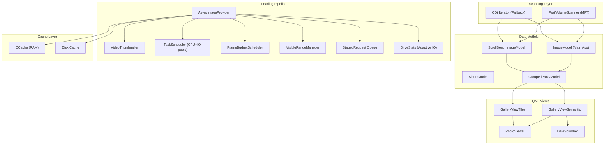

# 100k+ Image Scale Architecture Analysis

> **Source:** Graphify knowledge graph (3335 nodes, 282 communities) + direct code review
> **Date:** 2026-07-04
> **Scope:** Both `appSamsungGallery` (main) and `appScrollBench` (test bench)

---

## 1. Current Architecture Overview



### Key Data Flow (Current)

| Step | Component | What Happens | Scaling Problem at 100k+ |
|------|-----------|-------------|--------------------------|
| 1 | `scanDirectory()` | Walks filesystem, builds `QList<ImageInfo>` | **All 100k+ items loaded into RAM at once** |
| 2 | `QFileInfo` per file | Reads date, size from filesystem | **100k stat() calls = 10-30s on HDD** |
| 3 | `std::sort` | Sorts by date | 100k items: ~50ms (OK) |
| 4 | `beginResetModel/endResetModel` | **Nukes the entire QML view** | **QML re-instantiates all 100k delegates** |
| 5 | Viewport binds | `visibleStartIndex/visibleEndIndex` | Works, but initial storm of requests |
| 6 | `AsyncImageProvider` | Decodes thumbnails on worker threads | Staging queue + DriveStats throttle (OK) |
| 7 | `FrameBudgetScheduler` | Limits completions per 16ms frame | Works, but only in ScrollBench |

---

## 2. The Slider Bug — Root Cause

The "slider bug" is actually **two interacting problems**:

### Bug A: `onMoved` fires on every slider tick (Grid Zoom slider)
In [PerformanceOverlay.qml](file:///d:/Dev/antigravity/test_scrollbench/qml/PerformanceOverlay.qml#L243-L247):
```qml
Slider {
    Layout.fillWidth: true; from: 20; to: 400; stepSize: 4
    value: settings.gridSize
    onMoved: settings.gridSize = Math.round(value)  // ← fires every pixel of drag
}
```
Every tick of the slider immediately writes `settings.gridSize`, which triggers QML to relayout the entire `GridView`. At 100k items, this causes **hundreds of layout recalculations per second** while dragging.

### Bug B: The Thumb Resolution slider IS correctly debounced but…
The thumb slider uses `onPressedChanged` (only fires on release), and the `GalleryViewScrollBench` has a 400ms debounce timer. **However**, the grid zoom slider has no such protection — it directly binds to `settings.gridSize` via `onMoved`.

### The Fix
The Grid Zoom slider needs the same `onPressedChanged` pattern:
```qml
Slider {
    Layout.fillWidth: true; from: 20; to: 400; stepSize: 4
    value: settings.gridSize
    onPressedChanged: {
        if (!pressed) {
            settings.gridSize = Math.round(value)
        }
    }
}
```

> [!WARNING]
> The same `onMoved` pattern also exists for Cache Size and Thread Count sliders — those should also be changed to `onPressedChanged` to prevent rapid-fire setting writes.

---

## 3. Main App Pipeline Restoration

The main app (`appSamsungGallery`) is **missing critical components** that ScrollBench has:

| Feature | ScrollBench | Main App | Gap |
|---------|-------------|----------|-----|
| Viewport Culling | `viewportCullingEnabled` property | Basic `visibleStartIndex/endIndex` | Missing culling toggle |
| Frame Budget Scheduler | Full `FrameBudgetScheduler` | Not connected | **Critical** for 100k |
| Incremental Loading | Batched inserts + `processPendingUpdates` | `beginResetModel/endResetModel` | **Model reset kills perf** |
| Debounced Resolution | 400ms timer on `thumbnailSize` | No debounce | Slider storm |
| Selection System | Full multi-select | None | Feature gap |
| Diagnostics | `DiagnosticsMonitor` | None | Debug gap |
| Scan Cancellation | `cancelScan()` + `m_scanGeneration` | None | UX gap |

> [!IMPORTANT]
> The main app's `ImageModel::scanDirectory()` does `beginResetModel()` → bulk load → sort → `endResetModel()`. This is the **single biggest scalability bottleneck** — QML processes all 100k items at once after `endResetModel()`.

---

## 4. Ten Ways to Improve the Current Architecture

These are **incremental changes** that work within the existing codebase:

### 1. Debounce ALL sliders
Change `onMoved` → `onPressedChanged` for Grid Zoom, Cache Size, and Thread Count sliders in both apps. **Immediate fix, no architectural change.**

### 2. Incremental model insertion (batched `beginInsertRows`)
Replace `beginResetModel/endResetModel` with batched `beginInsertRows(N, N+99)` / `endInsertRows()` using a `QTimer` to insert 100 items per frame tick. QML only creates delegates for visible items. **Biggest single performance win.**

### 3. Defer `QFileInfo` stat calls
Currently every file gets `stat()`ed during scan for date/size. Instead: scan filenames first (MFT/dir walk), insert placeholders, then lazy-load metadata only for visible items. **Cuts scan time from 10-30s to <1s for 100k files.**

### 4. Wire FrameBudgetScheduler into the main app
The main app creates but never connects the `FrameBudgetScheduler`. Wire it up the same way ScrollBench does to throttle decode completions to ~4-10 per 16ms frame.

### 5. Implement virtual viewport with buffer zones
Currently the `visibleStartIndex/visibleEndIndex` drives loading. Add a 2-screen buffer: load thumbnails for `visible ± 200` items, cancel requests outside that window. Already partially done in ScrollBench's `updateVisibleRange()` but the buffer is too small for 100k.

### 6. Add a stall recovery timer
The `AsyncImageProvider` has `checkStalls()` but **no timer calls it** (documented in [OUTSTANDING_TASKS.md](file:///d:/Dev/antigravity/docs/resume/OUTSTANDING_TASKS.md)). Add a 5-second `QTimer` that calls `checkStalls()` to recover from network drive hangs.

### 7. Fix the `activeWeight` double-increment bug
In `AsyncImageProvider::processImageTask`, `activeWeight` is incremented at admission AND inside the task body. Only increment once at admission, decrement on completion. This prevents the concurrency limiter from over-counting.

### 8. Add placeholder thumbnails during loading
Instead of showing nothing until decode completes, show a colored rectangle based on the file's dominant color (extracted from EXIF thumbnail in ~1ms). Eliminates visual "popping" when scrolling through 100k items.

### 9. Implement priority inversion for scroll direction
When the user scrolls DOWN, prioritize loading items at the bottom of the viewport. When scrolling UP, prioritize top items. Currently the staging queue uses LIFO which approximately does this, but doesn't account for scroll direction explicitly.

### 10. Pre-sort files during MFT scan
`FastVolumeScanner` returns files in MFT order (essentially random). Sort by `CreationTime` during the MFT walk itself (the MFT record has timestamps) to avoid the O(n log n) sort on the main thread for 100k items.

---

## 5. Ten "Clean Sheet" Improvements (If We Could Do Better)

These are architectural changes that go beyond incremental fixes:

### 1. Database-backed model (SQLite)
Replace `QList<ImageInfo>` with a SQLite database. Store file paths, dates, sizes, thumbnail hashes. Query with `LIMIT/OFFSET` for pagination. The model becomes a thin cursor over the database, never holding 100k items in RAM.

### 2. Tile-based virtual scrolling
Instead of a `GridView` with 100k delegates, implement a tile renderer that only creates ~50 delegate items and repositions them as the user scrolls (like a tile map). `QQuickTableView` does this natively in Qt 6.4+.

### 3. Multi-resolution thumbnail pyramid
Pre-generate 3 thumbnail sizes on first scan (32px, 128px, 512px). Show 32px during fast scroll, upgrade to 128px when velocity drops, show 512px when the user stops. Store in a single `.thumbnails.db` file per scanned directory.

### 4. GPU-resident thumbnail atlas
Pack decoded thumbnails into a single GPU texture atlas (e.g., 4096×4096 = 1024 thumbnails at 128px each). QML renders from the atlas via custom `QSGNode` — zero per-item texture upload cost. A single atlas swap replaces 1000 individual image loads.

### 5. Background indexing service
Run a persistent background service that watches folders and maintains an always-current index. The app opens the index file and is instantly ready — no scan phase at all. Similar to Windows Search Index but controlled by the app.

### 6. Streaming scan with insertion sort
Instead of scan → sort → reset, stream files as they're discovered, inserting each into its sorted position in the model using binary search (`O(log n)` per insert). The view is always sorted and always live during the scan.

### 7. Prefetch prediction engine
Track the user's scroll velocity and direction. Predict which items will become visible in 500ms. Start decoding those items before they're in the viewport. Cancel items moving out of the predicted window.

### 8. Memory-mapped thumbnail cache
Use `QFile` with memory mapping to store thumbnails in a single binary file. Each thumbnail at a known offset. Loading becomes a pointer dereference — no I/O syscall, no malloc. The OS handles page faults transparently.

### 9. Hierarchical date clustering with lazy expansion
Don't show individual items at the top level for 100k files. Show date clusters (e.g., "June 2026 — 3,412 photos") with a cover thumbnail. Expand on tap to show individual items. The model only materializes items for expanded clusters.

### 10. WebGPU compute shader decode pipeline
Use WebGPU compute shaders for JPEG/PNG decoding directly on the GPU. Bypass the CPU entirely for thumbnail generation. Qt 6.7+ has experimental WebGPU support via RHI. Theoretical throughput: 1000+ thumbnails/second.

---

## 6. SWOT Analysis — Synthesis

### Strengths (Current Architecture)
| # | Strength | Evidence |
|---|----------|----------|
| S1 | **Proven pipeline for 5-10k images** | ScrollBench handles 5k items smoothly with viewport culling + frame budget |
| S2 | **Adaptive I/O throttling** | `DriveStats` per drive root dynamically adjusts concurrency limits |
| S3 | **Two-tier task scheduler** | Separate CPU and IO thread pools prevent decoder work from starving file I/O |
| S4 | **MFT fast scan** | `FastVolumeScanner` enumerates NTFS volumes in milliseconds vs seconds for `QDirIterator` |
| S5 | **Request coalescing** | `m_pendingResponses` prevents duplicate decode work for the same image |
| S6 | **Disk cache layer** | Decoded thumbnails persist across sessions |
| S7 | **Modular test bench** | ScrollBench lets us prototype features without risking the main app |

### Weaknesses (Current Architecture)
| # | Weakness | Impact at 100k |
|---|----------|----------------|
| W1 | **`beginResetModel` on full dataset** | QML re-creates all delegates. At 100k: 2-5 second UI freeze |
| W2 | **All items in RAM** | `QList<ImageInfo>` × 100k ≈ 80-120MB just for metadata |
| W3 | **Synchronous stat() per file** | 100k `QFileInfo` calls on HDD = 15-30 seconds during scan |
| W4 | **No scan cancellation in main app** | User can't interrupt a 30-second scan |
| W5 | **Slider fires continuous relayout** | Grid zoom slider triggers 100+ relayouts/second |
| W6 | **Concurrency leak (activeWeight)** | Under-loads network drives, over-loads local SSDs |
| W7 | **No stall recovery timer** | Network drive hangs freeze the decode pipeline permanently |
| W8 | **Main app missing FrameBudget** | No throttle on decode completions → UI thread floods |

### Opportunities (Clean Sheet Improvements)
| # | Opportunity | Feasibility | Impact |
|---|-------------|-------------|--------|
| O1 | **SQLite-backed model** | Medium (2-3 days) | Eliminates RAM pressure, enables instant re-open |
| O2 | **Tile-based virtual scroll** | High (Qt 6.4 `TableView`) | Zero-cost scrolling at any dataset size |
| O3 | **Thumbnail pyramid** | Medium (1-2 days) | Eliminates decode work during fast scroll |
| O4 | **GPU texture atlas** | Low (custom QSG) | 10-100× faster texture upload |
| O5 | **Background indexer** | Medium (persistent service) | Zero scan time on app open |
| O6 | **Streaming insertion sort** | High (incremental) | Live view during scan, no reset |
| O7 | **Scroll prediction** | Medium (velocity tracking) | Pre-warm cache for smooth scroll |
| O8 | **Memory-mapped cache** | High (simple file format) | Near-zero load latency |
| O9 | **Hierarchical clustering** | Medium (new view mode) | Manages 100k cognitively |
| O10 | **GPU decode pipeline** | Low (experimental Qt) | Removes CPU bottleneck entirely |

### Threats (Risks)
| # | Threat | Mitigation |
|---|--------|------------|
| T1 | **Qt `GridView` isn't designed for 100k items** | Move to `TableView` or custom tile renderer |
| T2 | **Network drives have 50-200ms latency per stat()** | Defer metadata to lazy load; show placeholders |
| T3 | **RAM exhaustion with 100k decoded thumbnails** | LRU eviction in `QCache` is already implemented but cost needs tuning |
| T4 | **Windows commit limit** | Monitor via `SystemMonitor`; cap in-flight decodes |
| T5 | **Format diversity** | RAW/DNG/HEIC each have different decode costs; need per-format budget weights |
| T6 | **Two divergent codebases** | Main app and ScrollBench are drifting apart; need to merge or choose one |

---

## 7. Recommended Priority Order

Based on **impact × feasibility** for reaching 100k:

| Priority | Action | Type | Est. Effort |
|----------|--------|------|-------------|
| 🔴 P0 | Fix slider bug (`onMoved` → `onPressedChanged`) | Bug fix | 15 min |
| 🔴 P0 | Replace `beginResetModel` with batched `beginInsertRows` | Architecture | 2-4 hours |
| 🟡 P1 | Wire FrameBudgetScheduler into main app | Integration | 1 hour |
| 🟡 P1 | Defer `QFileInfo` stat calls (lazy metadata) | Performance | 3-4 hours |
| 🟡 P1 | Add stall recovery timer + fix activeWeight bug | Bug fix | 1 hour |
| 🟢 P2 | Streaming insertion sort during scan | Architecture | 4-6 hours |
| 🟢 P2 | Multi-resolution thumbnail pyramid | Feature | 1-2 days |
| 🔵 P3 | SQLite-backed model | Architecture | 2-3 days |
| 🔵 P3 | Hierarchical date clustering | UX/Feature | 2-3 days |
| ⚪ P4 | GPU texture atlas | Advanced | 1 week+ |

> [!TIP]
> **P0 items alone will make 100k viable.** The slider fix + batched insertion + FrameBudget will get you from "5-second freeze" to "smooth scroll" for 100k items. Everything beyond that is optimization for an even better experience.
