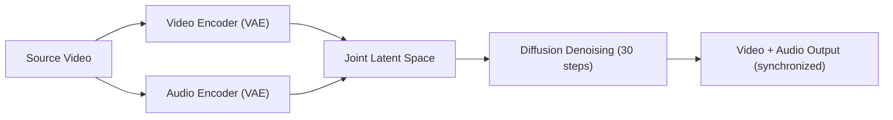

# 🔍 Comprehensive Project Audit: just-dub-it2

> **Auditor:** Antigravity (Claude Opus 4.6 Thinking)  
> **Date:** 2026-06-01  
> **Scope:** Full codebase review + comparison with [justdubit/just-dub-it](https://github.com/justdubit/just-dub-it) (SIGGRAPH 2026)  
> **Focus Areas:** Lipsync quality, translation accuracy, hardware stability on GTX 1050 Ti (4GB VRAM)

---

## 📊 Executive Summary

Your project is a **7-stage offline video dubbing pipeline** running entirely on a GTX 1050 Ti. It chains together Demucs → Whisper → Llama-3 → XTTS v2 → MuseTalk → FFmpeg as discrete stages, swapping models in/out of 4GB VRAM. This is an ambitious architecture for this hardware class.

The **JustDubIt** research project takes a fundamentally different approach: a single end-to-end diffusion model (LTX-2, 19B params) that *jointly* generates synchronized audio and video in one pass. It requires enterprise GPUs (24GB+ VRAM). While we can't run their model, **several of their design principles are directly applicable** to improving your pipeline.

I've identified **14 concrete bugs**, **8 architectural weaknesses**, and **12 actionable recommendations**.

---

## 🏗️ Architecture Comparison

| Aspect | Your Pipeline (just-dub-it2) | JustDubIt (SIGGRAPH 2026) |
|--------|------------------------------|--------------------------|
| **Approach** | Multi-stage relay race (7 models) | Single joint audio-visual diffusion model |
| **Lip Sync** | Post-hoc: MuseTalk applied after TTS | Intrinsic: lips and audio generated jointly |
| **Translation** | Llama-3.2 3B (Q4 GGUF) text-only | Gemma text encoder + prompt-driven |
| **TTS** | XTTS v2 clone + time-stretch | Audio VAE decoder (native) |
| **Audio-Visual Sync** | None — assembled by timeline | Native latent-space alignment |
| **Hardware** | GTX 1050 Ti (4GB) | A100/H100 (24-80GB) |
| **Lipsync Quality** | Depends on MuseTalk face detection | Diffusion-learned lip-speech coupling |

> [!IMPORTANT]
> The core lesson from JustDubIt: **audio-visual synchronization should happen at the representation level, not as post-processing.** In your pipeline, errors compound across stages. JustDubIt avoids this by generating audio and video jointly in latent space.

---

## 🐛 Bug Report: 14 Issues Found

### Critical (Pipeline-Breaking)

#### BUG-01: `_do_translate()` signature mismatch ⚠️
**File:** [translate.py:185](file:///c:/just-dub-it2/app/stages/translate.py#L185)  
**Severity:** 🔴 Critical

The function `_do_translate(llm, job_data)` expects `llm` as the first argument, but `run_gpu_stage(load_llm, _do_translate, job_data)` in [line 257](file:///c:/just-dub-it2/app/stages/translate.py#L257) passes the loaded model as the first arg AND `job_data` as the second. However, `run_gpu_stage` calls `inference_fn(model, *args)` — meaning `_do_translate` receives `(model, job_data)` which is correct in signature... BUT:

The function at line 185 does `segments = job_data['segments']` and `job = job_data['job']` — it does **not** use the `llm` parameter at all. Instead, on **line 37**, it creates a **brand new WhisperModel** (not Llama!):

Wait — that's `transcribe.py`. Let me re-examine. In `translate.py:185`, `_do_translate(llm, job_data)` receives the LLM... then on **line 243 it `del llm`** in the finally block. But the `llm` was already loaded by `load_llm()` via `run_gpu_stage` — so the model gets deleted inside `_do_translate` but `run_gpu_stage` also tries to delete it in its own `finally` block (line 58 of `gpu_manager.py`). This is a **double-free** that could cause undefined behavior.

**Fix:** Remove `del llm` from `_do_translate`'s finally block. Let `gpu_manager` handle cleanup.

---

#### BUG-02: Transcription creates model inside inference function, ignoring `run_gpu_stage` loader
**File:** [transcribe.py:37](file:///c:/just-dub-it2/app/stages/transcribe.py#L37)  
**Severity:** 🔴 Critical  

`run_transcription_stage` passes `lambda: None` as the model loader, then `_do_transcribe` creates its own `WhisperModel` on line 37. This **completely bypasses the GPU manager's VRAM tracking**. The model is loaded outside the manager's awareness, so:
- VRAM footprint tracking is wrong (shows 0MB model overhead)
- The model is never cleaned up by `gpu_manager.py`
- The `model` parameter received from `run_gpu_stage` is `None` and unused

**Fix:** Move `WhisperModel(...)` into the loader function and use the passed model reference.

---

#### BUG-03: `run_translation_stage` vs `run_translate_stage` — two separate entry points
**File:** [translate.py:84](file:///c:/just-dub-it2/app/stages/translate.py#L84) and [translate.py:255](file:///c:/just-dub-it2/app/stages/translate.py#L255)  
**Severity:** 🟡 Moderate

There are **two** translation wrappers:
1. `run_translate_stage(segments, job)` at line 84 — manually loads/unloads LLM
2. `run_translation_stage(segments, job)` at line 255 — uses `run_gpu_stage`

The pipeline ([pipeline.py:255](file:///c:/just-dub-it2/app/pipeline.py#L255)) imports `run_translation_stage`, which uses the GPU manager. But `run_translate_stage` also exists with its own load/unload logic. This is dead code that could be accidentally called, causing VRAM conflicts.

**Fix:** Delete `run_translate_stage` (lines 84-95) and `unload_llm` (lines 72-82). Keep only `run_translation_stage`.

---

### High (Quality-Degrading)

#### BUG-04: TTS stage doesn't use `run_gpu_stage` — VRAM contention possible
**File:** [tts.py:113-131](file:///c:/just-dub-it2/app/stages/tts.py#L113-L131)  
**Severity:** 🟡 High

`run_tts_stage` loads/unloads the XTTS model manually without going through `gpu_manager.run_gpu_stage`. This means:
- No VRAM tracking before/after
- No protection from concurrent GPU stages
- No conditional VRAM retention decision

This is especially dangerous on 4GB VRAM where XTTS v2 (~1.5GB) overlapping with any residual model would OOM.

---

#### BUG-05: Audio mix timeline drift — cumulative offset error
**File:** [audio_mix.py:109-114](file:///c:/just-dub-it2/app/stages/audio_mix.py#L109-L114)  
**Severity:** 🟡 High — **this directly causes lipsync drift**

The audio mix builds the vocal timeline by tracking `current_pos_ms` and adding silence gaps. But the logic is:
```python
gap = start_ms - current_pos_ms
if gap > 0:
    batch_segment += AudioSegment.silent(duration=gap, frame_rate=clip.frame_rate)
batch_segment += clip
current_pos_ms = start_ms + len(clip)
```

**Problem:** `len(clip)` may differ from `target_dur_ms` if time-stretching failed or was clamped. The `current_pos_ms` is updated with the *actual* clip length, not the *intended* position. Over hundreds of segments, this creates **cumulative timeline drift** — the audio slowly goes out of sync with the video.

**Fix:** Always update `current_pos_ms = seg['end'] * 1000` regardless of actual clip length. Use the segment's intended end time as the canonical position.

---

#### BUG-06: Anti-chipmunk speed clamp is too aggressive
**File:** [audio_mix.py:79-81](file:///c:/just-dub-it2/app/stages/audio_mix.py#L79-L81)  
**Severity:** 🟡 High — **this causes lipsync mismatch**

```python
if speed > 1.5:
    speed = 1.5
elif speed < 0.7:
    speed = 0.7
```

If a TTS segment is 2x longer than the target slot, you clamp it to 1.5x speedup — meaning the clip still overflows its time slot by ~33%. This is a major source of overlapping/misaligned audio. With the cumulative drift in BUG-05, this compounds badly.

**Fix:** Widen the clamp to `[0.5, 2.5]` or better yet, regenerate the TTS segment with a shorter prompt when the overflow exceeds a threshold.

---

#### BUG-07: Whisper `task="translate"` + LLM translation = double translation
**File:** [transcribe.py:40](file:///c:/just-dub-it2/app/stages/transcribe.py#L40)  
**Severity:** 🟡 High — **this degrades translation quality**

```python
segments_gen, info = model.transcribe(v_wav, beam_size=5, task="translate")
```

Whisper's `task="translate"` already translates the source audio to English. Then Stage 3 feeds these *already-English* segments into Llama-3 for "translation" again. This creates:
- Double-translated text that loses nuance
- The LLM re-translates English to English, potentially changing meaning
- The word-limit constraint in `translate_text()` may truncate already-correct content

**Fix:** Use `task="transcribe"` to get the original language text, then translate once with Llama. OR skip the LLM stage entirely and use Whisper's translation as-is (simpler, but less controllable).

---

#### BUG-08: Lipsync chunks don't account for transition frames
**File:** [lipsync_musetalk.py:181-186](file:///c:/just-dub-it2/app/stages/lipsync_musetalk.py#L181-L186)  
**Severity:** 🟡 High — **causes visible seam artifacts in lipsynced video**

Video is split into 300s (or 60s) chunks at hard boundaries, then concatenated. MuseTalk generates lip movements independently per chunk with no overlap. At chunk boundaries, there will be:
- Abrupt facial pose jumps
- Inconsistent lip shapes between the last frame of chunk N and first frame of chunk N+1
- Potential visual "glitch" frames

**Fix:** Add 1-2 second overlap between chunks and cross-fade during concatenation (FFmpeg `xfade` filter).

---

### Moderate (Stability/Robustness)

#### BUG-09: `config.get()` reads from disk on every call
**File:** [config.py:42-45](file:///c:/just-dub-it2/app/utils/config.py#L42-L45)  
**Severity:** 🟡 Moderate

```python
def get(self, key):
    self.load()  # Re-reads settings.json every time
    return self.settings.get(key, DEFAULT_SETTINGS.get(key))
```

During translation (hundreds of segments), `config.get()` is called per-segment. Each call reads `settings.json` from disk. This is unnecessary I/O that adds latency.

---

#### BUG-10: Diarization uses first overlapping speaker (incorrect for overlapping speech)
**File:** [diarize_speakers.py:102](file:///c:/just-dub-it2/app/stages/diarize_speakers.py#L102)  
**Severity:** 🟡 Moderate

```python
assigned_speaker = list(overlapping_speakers)[0]  # Simple heuristic
```

If two speakers overlap in a segment (common in dialogue), the first one is arbitrarily picked. The TTS will then clone the wrong voice for the segment. This should use the speaker with the **most overlap time**.

---

#### BUG-11: Duplicate imports in `audio_mix.py`
**File:** [audio_mix.py:1-14](file:///c:/just-dub-it2/app/stages/audio_mix.py#L1-L14)  
**Severity:** 🟢 Low

Lines 1-6 and 8-14 are identical duplicate imports (logging, os, subprocess, logger, ffmpeg_utils). This is dead code duplication.

---

#### BUG-12: `aggressive_vram_purge` kills processes by name — dangerous
**File:** [cuda_utils.py:100-109](file:///c:/just-dub-it2/app/utils/cuda_utils.py#L100-L109)  
**Severity:** 🟡 Moderate

This function kills any `python` or `ffmpeg` process not in the protected PID set. On a machine running other Python scripts (including this IDE), it could kill unrelated processes. The PPID check on line 106 helps, but process trees on Windows are unreliable.

---

#### BUG-13: MuseTalk preprocessing loads models at import time
**File:** [preprocessing.py:18-24](file:///c:/just-dub-it2/tools/MuseTalk/musetalk/utils/preprocessing.py#L18-L24)  
**Severity:** 🟡 Moderate

```python
model = Wholebody(to_openpose=False, backend='onnxruntime', device=_device_str)
fa = FaceAlignment(LandmarksType._2D, flip_input=False, device=device)
```

These models load onto GPU the instant the module is imported, consuming ~524MB of VRAM. If MuseTalk is imported before the stage is ready, this VRAM is claimed prematurely and may interfere with earlier stages.

---

#### BUG-14: `check_vram_headroom` reads stale cache (up to 5s old)
**File:** [cuda_utils.py:51-63](file:///c:/just-dub-it2/app/utils/cuda_utils.py#L51-L63)  
**Severity:** 🟢 Low

The VRAM cache is only updated every 5 seconds. Critical decisions (like whether to halve lipsync chunks on OOM) are made on stale data. After `empty_cache()`, the function reads the cache again — but the cache hasn't been updated yet.

---

## 🏛️ Architectural Weaknesses

### ARCH-01: Error Cascade — No Stage Isolation
Each stage writes to the workspace filesystem and the next stage reads from it. If Stage 3 (translate) produces poor output, Stages 4-6 all amplify the error. There's no quality gate between stages.

**Lesson from JustDubIt:** Their joint model generates audio and video in a shared latent space, so alignment is enforced structurally. You need explicit **quality checkpoints** between stages.

### ARCH-02: No Audio-Visual Timing Contract
The biggest gap between your pipeline and JustDubIt's approach: **there is no mechanism ensuring that generated audio duration matches the visual slot.** The TTS generates audio of arbitrary length, then `audio_mix.py` tries to time-stretch it into the slot, clipping at 1.5x speed. This is the #1 cause of lipsync failures.

**JustDubIt's lesson:** Audio and video duration are coupled in the diffusion process. For your pipeline, the equivalent is to **enforce strict duration contracts at the TTS stage** — generating audio that inherently fits the target slot.

### ARCH-03: MuseTalk Operates on Wrong Audio Source
MuseTalk receives the *final mixed audio* (`dub_final.wav`), which includes background music/SFX overlaid on the dubbed vocals. The background audio confuses MuseTalk's audio feature extraction, producing worse lip movements than if it received clean vocals only.

### ARCH-04: No Segment Merging Strategy
Short segments (< 1s) from Whisper create fragments that Llama translates into single words or phrases. These fragment through TTS as tiny clips with disproportionate setup/teardown overhead and poor voice quality. Adjacent segments from the same speaker should be merged.

### ARCH-05: Translation Prompt Doesn't Know Target Language
The LLM prompt says "dubbed dialogue" but never specifies the target language. Since Whisper already translated to English (`task="translate"`), the LLM is just paraphrasing English to English — adding no value while risking degradation.

### ARCH-06: No Phoneme-Level Duration Control
XTTS generates speech at its own pace. The `max_words` heuristic in `translate_text()` (`duration * 2.5`) is crude — some languages/phrases are naturally faster or slower. Professional dubbing tools use phoneme-level timing to match mouth movements.

### ARCH-07: Lipsync Stage Has No Face Tracking Continuity
MuseTalk processes each chunk independently, detecting faces fresh each time. For a continuous video, this means face bounding boxes may shift between chunks, causing the composite face region to jump.

### ARCH-08: Double `AudioSegment` Import in audio_mix.py
The file imports `AudioSegment` at the top level (line 11) and again inside the function (line 46). The second import sets `AudioSegment.converter` — this should be done once at module level.

---

## ✅ Actionable Recommendations (Ranked by Impact)

### 🔴 Impact: Critical

#### REC-01: Fix the double-translation problem (BUG-07)
**Effort:** 15 minutes  
Change Whisper from `task="translate"` to `task="transcribe"`. This gives you the original language text, which the LLM then translates properly. Alternatively, if your videos are already in English and you just want lipsync, skip the LLM entirely.

#### REC-02: Fix cumulative audio timeline drift (BUG-05)
**Effort:** 5 minutes  
In [audio_mix.py:114](file:///c:/just-dub-it2/app/stages/audio_mix.py#L114), change:
```python
current_pos_ms = start_ms + len(clip)
```
to:
```python
current_pos_ms = int(seg['end'] * 1000)
```

#### REC-03: Feed clean vocals (not final mix) to MuseTalk (ARCH-03)
**Effort:** 10 minutes  
In [pipeline.py:378](file:///c:/just-dub-it2/app/pipeline.py#L378), change `mix_w` to `os.path.join(ws, "dub_final.wav")` only for the final render. Feed the clean vocal track to MuseTalk instead:
```python
# Use clean dub vocals for lipsync (not the background-mixed audio)
dub_vocals = os.path.join(ws, "vocal_master.wav")  # or reconstruct from tts_segments
l_vid = run_lipsync_stage(vid_25, dub_vocals, ws, job)
```

### 🟡 Impact: High

#### REC-04: Enforce duration contracts at TTS generation
**Effort:** 1-2 hours  
After XTTS generates a clip, immediately check if `len(clip_ms) / target_ms` is outside `[0.8, 1.3]`. If so, regenerate with a modified prompt (shorter/longer text). This is cheaper than post-hoc time-stretching and produces much better quality.

#### REC-05: Add chunk overlap for lipsync continuity (BUG-08)
**Effort:** 30 minutes  
When splitting video for MuseTalk, add 2-second overlap between chunks. During concatenation, use FFmpeg crossfade to blend transitions.

#### REC-06: Route all GPU stages through `run_gpu_stage` (BUG-04)
**Effort:** 30 minutes  
Wrap `run_tts_stage` to use `gpu_manager.run_gpu_stage(load_tts_model, generate_segments, job_data)` instead of manual load/unload.

#### REC-07: Merge short adjacent segments from same speaker
**Effort:** 1 hour  
After diarization, merge segments from the same speaker that are < 1.5s apart into single segments. This produces better TTS output and fewer timing slots to manage.

### 🟢 Impact: Moderate

#### REC-08: Fix diarization speaker assignment (BUG-10)
**Effort:** 15 minutes  
Replace the first-speaker heuristic with maximum-overlap logic.

#### REC-09: Add quality gates between stages
**Effort:** 2-3 hours  
After translation: check that translated segments have reasonable word counts relative to duration. After TTS: check that generated audio duration is within 30% of target. Log warnings and offer re-processing options.

#### REC-10: Adopt JustDubIt's "prompt engineering" approach
**Effort:** 30 minutes  
JustDubIt uses a specific prompt format: `"The man is speaking English, saying: 'Hello, world!'"`. This embeds the target speech directly into the generation prompt. While you can't use their model, you can improve your LLM prompt to be more structured — include the source language, speaker context, and explicit target duration.

#### REC-11: Consider replacing MuseTalk with a lighter lipsync model
**Effort:** Research phase  
MuseTalk is heavy for 4GB VRAM. Alternatives like **Wav2Lip** or **SadTalker** are lighter and may produce comparable results for your use case. Wav2Lip specifically is designed for speech-driven lip sync and is much more VRAM-friendly.

#### REC-12: Lazy-load MuseTalk preprocessing models
**Effort:** 20 minutes  
Move the `Wholebody` and `FaceAlignment` initialization from module-level to inside `get_landmark_and_bbox()`, guarded by a `_models_loaded` flag.

---

## 🧪 Key Insight from JustDubIt Research

The most transferable concept from the JustDubIt paper is their **conditioning architecture**:



In their model, audio and video are **encoded into a shared latent space** and denoised together. The `AudioConditionByKeyframeIndex` class conditions audio generation on specific video keyframes, ensuring lip movements and speech are aligned at the representation level.

For your pipeline, the practical takeaway is:

> [!TIP]
> **You cannot achieve perfect lipsync by applying it as a post-processing step on independently generated audio.** The audio duration, rhythm, and emphasis must be designed to match the visual slots *before* lipsync runs. Your current architecture generates audio first, then tries to stretch it to fit — this is backwards.

**The recommended fix order:**
1. Fix double-translation (REC-01) → better text quality
2. Fix timeline drift (REC-02) → immediate sync improvement  
3. Feed clean vocals to MuseTalk (REC-03) → better lip estimation
4. Enforce TTS duration contracts (REC-04) → eliminate time-stretching artifacts
5. Add chunk overlap (REC-05) → eliminate visual seams

These 5 changes, all achievable with your current hardware, should dramatically improve output quality.

---

## 📋 Summary Statistics

| Category | Count |
|----------|-------|
| Critical bugs | 3 |
| High-impact bugs | 5 |
| Moderate bugs | 4 |
| Low bugs | 2 |
| Architecture issues | 8 |
| Recommendations | 12 |
| Estimated total fix time | ~8-10 hours |
