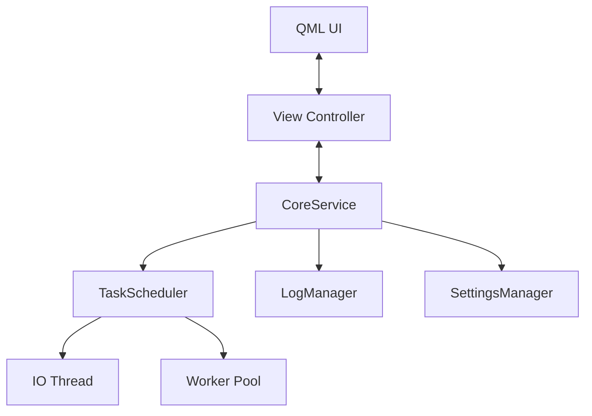

# Architecture V2: "SamsungGallery Reforged"

## 1. Philosophy & Goals
- **Stability**: 99.99% Uptime. Failures in sub-tasks must not crash the application.
- **Performance**: "10/10 Lightweight". UI must never block.
- **Concurrency**: Main Thread as "Governor". Heavy lifting in "Worker Threads" with Priority.
- **Safety**: Memory Safe (RAII), Thread Safe (Actors/Signals), Type Safe.
- **Portability**: Windows 10/11 (Best Effort Win 7). Portable Deployment.

## 2. Core Architecture: The "Kernel" Pattern
The application will be restructured around a central `CoreService` (The Kernel) that manages lifecycle and dependencies.

### 2.1 Threading Model
- **Main Thread (UI & Governor)**:
  - Handles QML rendering and User Input.
  - Owns `CoreService`.
  - Dispatches tasks to the Scheduler.
  - **NEVER** performs File I/O or Image Decoding.
  
- **IO Thread (High Priority)**:
  - Dedicated thread for *fast* metadata reads and file system indexing.
  - Prevents "Thread Starvation" where all worker threads are stuck decoding large JPEGs.
  
- **Worker Pool (Heavy Lifting)**:
  - `QThreadPool` for CPU-intensive tasks (Image Decoding, Raw Processing).
  - Tasks are prioritized:
    1.  **Immediate**: Thumbnail for currently visible grid cells.
    2.  **High**: Metadata for visible cells.
    3.  **Normal**: Pre-fetching next page.
    4.  **Low**: Background folder scanning.

### 2.2 Component Diagram

## 3. Modular Subsystems

### 3.1 Build System & Dependencies
- **CMake**: Enforce strict dependency handling.
- **3rdParty**:
  - **LibRaw**: Static Link.
  - **FFmpeg**: Dynamic Loading (Resolve at runtime) or Clean "Bin" deployment.
  - **Qt**: Dynamic Link (Standard), deployed via `windeployqt` for robust "Portable" folder.

### 3.2 Logging (The "Black Box")
- Centralized `LogManager`.
- Categories: `Core`, `IO`, `UI`, `Image`, `Video`.
- Ring Buffer in memory for crash dump generation.
- Async writing to disk to avoid blocking UI.

### 3.3 Test Driven Development (TDD)
- All new components (Scheduler, ImageDecoder) will have unit tests.
- **Rules**:
  - No merging code without a passing test.
  - Fix `tst_imagemodel` immediately.
  - Add `tst_scheduler`.

## 4. Implementation Plan

### Phase 1: The Foundation (Kernel)
1.  **Fix Build & Tests**: Make `tst_imagemodel` pass.
2.  **LogManager**: Implement robust logging.
3.  **TaskScheduler**: Implement the Priority Queue system.

### Phase 2: Refactoring Components
4.  **ImageModel v2**: Refactor to use `TaskScheduler` instead of `QtConcurrent::run`.
5.  **Thumbnails v2**: precise prioritization based on UI viewport.

### Phase 3: Hardening
6.  **Memory Audit**: Replace raw pointers with `std::unique_ptr` / `QScopedPointer`.
7.  **Crash Handling**: Graceful degradation if a decoder crashes (try/catch around LibRaw).

## 5. Deployment
- **Portable**: A script will generate a clean `Dist/` folder with `App.exe` and all DLLs.
- **Single File**: Optional "Self-Extracting Archive" wrapper for best user experience on Windows.
