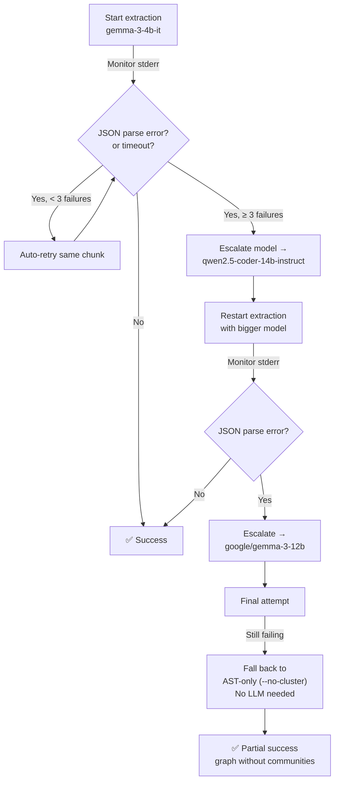
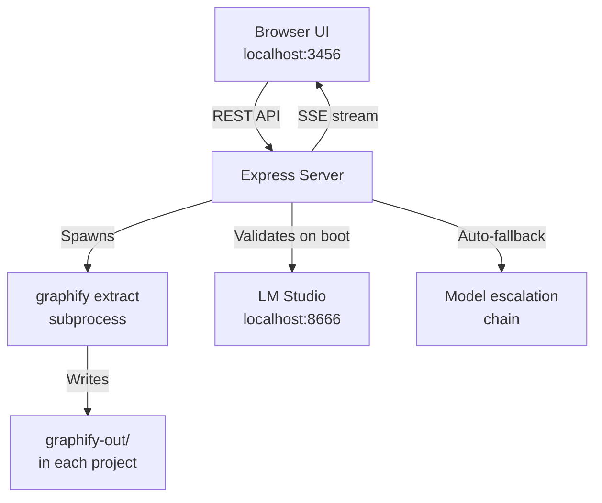
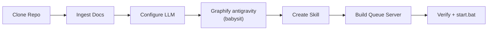

# Graphify Batch Queue — Execution Plan v2

> **Goal:** One-shot setup — graphify `antigravity` first (babysit it), then build a batch queue server so you can point-and-click any folder and walk away.

---

## Resolved Decisions

| Question | Decision |
|---|---|
| **LM Studio endpoint** | `http://localhost:8666/v1` — avoids network IO overhead vs `192.168.1.165` |
| **JSON error handling** | Auto-detect + auto-fallback at runtime (see Phase 3) |
| **Model** | Start with `gemma-3-4b-it`, auto-escalate if it fails |
| **Folder picker** | PowerShell native `FolderBrowserDialog` |
| **Server port** | `3456` |
| **Global graph** | Yes, `--global` enabled |
| **First project** | `d:\Dev\antigravity` — we babysit this one |
| **After that** | Queue via server UI, `.bat` file to launch everything |
| **Antigravity skill** | Yes — teach me to graphify any folder you point me at |

---

## Phase 1 — Clone Graphify Repo to `D:\Dev\tools\graphify`

```powershell
git clone https://github.com/safishamsi/graphify.git D:\Dev\tools\graphify
```

---

## Phase 2 — Ingest Graphify Internals

Read key source files from cloned repo: `llm.py`, `extract.py`, `build.py`, `cluster.py`, `report.py` — so I deeply understand how backends work, what errors look like, and how to configure local LLM endpoints.

---

## Phase 3 — Configure Local LLM Backend + Auto-Fallback

### Endpoint
```powershell
$env:OPENAI_BASE_URL = "http://localhost:8666/v1"
$env:OPENAI_API_KEY = "lm-studio"
```

### Auto-Fallback Chain (Built Into the Queue Server)

The server wraps `graphify extract` and **monitors stdout/stderr in real-time**. Here's how we detect and mitigate failures without manual intervention:



**Detection signals** (parsed from graphify's stderr/stdout):
- `JSONDecodeError` or `json.decoder.JSONDecodeError` — malformed LLM output
- `Invalid JSON` or `Expecting value` — partial/truncated response
- `TimeoutError` or `ReadTimeout` — model too slow
- `Connection refused` — LM Studio crashed/restarted
- Non-zero exit code with no `graph.json` produced

**What the `--api-timeout 600` covers:**
- It's the **per-HTTP-request timeout** — covers both the time waiting for LM Studio to start generating tokens AND the full token generation time. So if a single chunk takes > 10 minutes to process, it times out. This is generous for a 4B model that should respond in seconds.

### Model Fallback Order
| Priority | Model | Params | Why |
|---|---|---|---|
| 1st | `gemma-3-4b-it` | 4B | Your requested model, fastest |
| 2nd | `ibm/granite-4-h-tiny` | ~4B | IBM code-trained, good structured output for its size |
| 3rd | `qwen2.5-coder-14b-instruct` | 14B | Excellent at structured code JSON |
| 4th | `google/gemma-3-12b` | 12B | Larger Gemma, more reliable |
| 5th | `liquid/lfm2-24b-a2b` | 24B (MoE) | Largest model available, heavy hitter |
| Last | *No LLM* (`--no-cluster`) | — | AST-only graph, always works |

---

## Phase 4 — Graphify `antigravity` (Babysit Run)

This is the one we monitor closely. I run it, watch the output, handle any issues live.

```powershell
$env:OPENAI_BASE_URL = "http://localhost:8666/v1"
$env:OPENAI_API_KEY = "lm-studio"

graphify extract d:\Dev\antigravity `
  --backend openai `
  --model "gemma-3-4b-it" `
  --max-concurrency 1 `
  --api-timeout 600 `
  --global `
  --as "antigravity"
```

**Expected output in `d:\Dev\antigravity\graphify-out\`:**
- `graph.json` — the knowledge graph
- `graph.html` — interactive visual map
- `GRAPH_REPORT.md` — god nodes, communities, insights
- `cache/` — SHA256 cache for incremental re-runs

**Then install the Antigravity IDE integration:**
```powershell
cd d:\Dev\antigravity
graphify antigravity install
```

> [!NOTE]
> **What `graphify antigravity install` does:** It writes skill files and rules into your project so that in future sessions, when you open this project, I automatically read the `graphify-out/graph.json` and have instant architectural knowledge. No re-scanning needed.

---

## Phase 5 — Antigravity Graphify Skill

> *"Can I just point Antigravity at a folder and tell it to graphify?"*

**Yes.** We'll create a custom skill that I can invoke whenever you say something like *"graphify D:\Dev\beamsolver"*. This skill will:

1. Validate the path exists
2. Run `graphify extract` with the correct env vars and model
3. Stream progress back to you
4. Auto-fallback on errors (same chain as above)
5. Report results when done

This works for **any folder** — code projects, document collections, paper dumps. Graphify handles code, PDFs, markdown, images, etc.

**Skill file location:** `d:\Dev\antigravity\.gemini\skills\graphify-project\SKILL.md`

---

## Phase 6 — Build the Batch Queue Server

**Location:** `D:\Dev\tools\graphify-queue`

### Architecture



### Core Features

| Feature | Detail |
|---|---|
| **Add folders** | Native Windows `FolderBrowserDialog` — any drive, any path |
| **Queue multiple** | Add as many folders as you want, they process sequentially |
| **Live monitoring** | SSE streams real-time stdout/stderr per project |
| **Auto-fallback** | JSON errors trigger automatic model escalation |
| **Model validation** | On boot, confirms LM Studio is up + model is loaded |
| **Status per project** | `Queued` → `Running` → `Done` / `Failed` |
| **Retry / Remove** | Click to retry failed items or remove from queue |
| **Persistent state** | `queue-state.json` survives server restarts |
| **Global graph** | Every project auto-merges into `~/.graphify/global-graph.json` |
| **Output stays local** | Each project gets its own `graphify-out/` — nothing centralized |

### File Structure

```
D:\Dev\tools\graphify-queue\
├── server.js              # Express + queue engine + SSE + auto-fallback
├── package.json
├── queue-state.json       # Auto-created, persists queue state
├── public/
│   ├── index.html         # Premium dark-mode dashboard
│   ├── index.css          # Design system
│   └── app.js             # Frontend logic + SSE client
├── scripts/
│   └── folder-picker.ps1  # Native Windows dialog wrapper
└── start.bat              # Double-click to launch everything
```

### `start.bat` — One-Click Launcher

```batch
@echo off
title Graphify Batch Queue
echo Starting Graphify Batch Queue Server...
set OPENAI_BASE_URL=http://localhost:8666/v1
set OPENAI_API_KEY=lm-studio
cd /d D:\Dev\tools\graphify-queue
node server.js
pause
```

Double-click `start.bat` → server starts → opens browser → you're queuing.

---

## Phase 7 — Verify & Wrap Up

1. Confirm `antigravity` has `graphify-out/` with valid `graph.json`
2. Confirm I can read the graph and answer architectural questions about the project
3. Confirm the queue server starts clean via `start.bat`
4. Add one more test project via the UI to verify end-to-end
5. Confirm the Antigravity skill works ("graphify this folder")

---

## Execution Sequence



---

## What's NOT In Scope (For Now)

- Automatic scheduling / cron — manual queue only
- Multi-project simultaneous processing — one at a time (LLM constraint)
- Remote projects — local paths only
- Auto-discovery of project folders — you pick them via the UI

---

> [!TIP]
> **Ready to execute?** Say the word and I'll start at Phase 1 and run straight through to Phase 7. Consider using `/goal` for maximum thoroughness — I won't stop until everything works.
