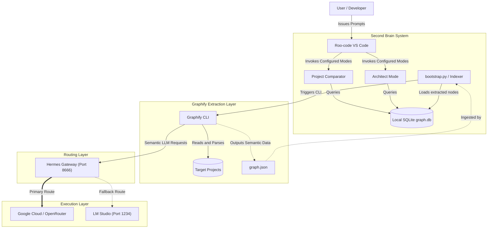

# Second Brain Architecture & Wiring Diagram

This diagram maps out exactly how data flows from your projects, through the Graphify extractor, up to the Hermes Gateway routing layer, and finally into the Roo-code modes.

### Flow Breakdown:
1. **Extraction**: `bootstrap.py` asks Graphify to scan your project folders.
2. **Routing**: Graphify hits port `8666` (the Hermes Gateway). The Gateway pushes the request to the Cloud for speed, but seamlessly falls back to LM Studio if there's a hiccup.
3. **Ingestion**: Graphify dumps the parsed AST and semantic data into `graph.json`. Our Indexer sucks that JSON up and stores it in the local SQLite `graph.db`.
4. **Analysis**: You ask Roo-code a question. Roo-code queries the local `graph.db` database and gives you the answer without ever needing to re-read your massive source code files.
